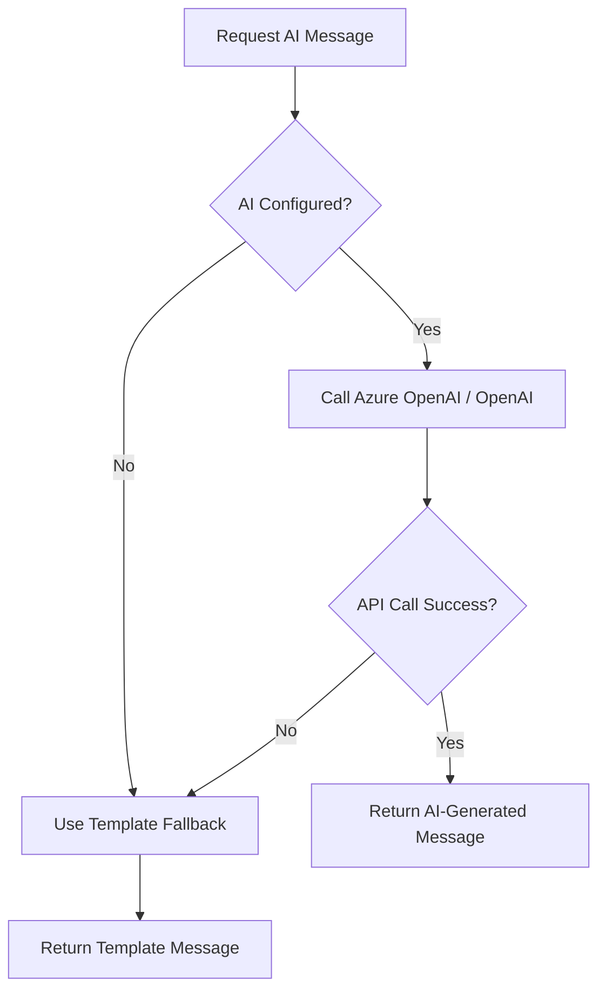

# Azure OpenAI Integration Setup Guide

## 🎯 Overview

The Joy backend now includes **full Azure OpenAI integration** for AI-powered message generation. The system supports both **Azure OpenAI** and **OpenAI** APIs, with automatic fallback to template-based messages if not configured.

---

## 🚀 Quick Start

### Option 1: Azure OpenAI (Recommended for Enterprise)

1. **Create Azure OpenAI Resource**
   - Go to [Azure Portal](https://portal.azure.com)
   - Create a new "Azure OpenAI" resource
   - Wait for deployment to complete

2. **Deploy a Model**
   - In your Azure OpenAI resource, go to "Model deployments"
   - Click "Create new deployment"
   - Choose `gpt-35-turbo` or `gpt-4`
   - Give it a deployment name (e.g., `gpt-35-turbo`)

3. **Get Your Credentials**
   - Go to "Keys and Endpoint"
   - Copy **Key 1** (your API key)
   - Copy **Endpoint** URL (e.g., `https://your-resource.openai.azure.com/`)

4. **Configure appsettings.Development.json**

```json
{
  "AzureOpenAI": {
    "Endpoint": "https://your-resource.openai.azure.com/",
    "ApiKey": "your-api-key-here",
    "DeploymentName": "gpt-35-turbo"
  }
}
```

### Option 2: OpenAI (Simpler Setup)

1. **Get OpenAI API Key**
   - Go to [OpenAI Platform](https://platform.openai.com)
   - Sign up or log in
   - Go to "API Keys" section
   - Create a new API key

2. **Configure appsettings.Development.json**

```json
{
  "OpenAI": {
    "ApiKey": "sk-your-openai-api-key-here",
    "Model": "gpt-3.5-turbo"
  }
}
```

### Option 3: No Configuration (Fallback Mode)

If you don't configure any API keys, the system will automatically use **template-based messages** - no setup required!

---

## 📝 Configuration Details

### Full Configuration Example

**`backend/Joy.Api/appsettings.Development.json`**

```json
{
  "Logging": {
    "LogLevel": {
      "Default": "Information",
      "Microsoft.AspNetCore": "Information"
    }
  },
  "AllowedOrigins": [
    "http://localhost:8081",
    "exp://localhost:19000"
  ],
  
  // Azure OpenAI Configuration (Option 1)
  "AzureOpenAI": {
    "Endpoint": "https://your-resource-name.openai.azure.com/",
    "ApiKey": "1234567890abcdef1234567890abcdef",
    "DeploymentName": "gpt-35-turbo"
  },
  
  // OR OpenAI Configuration (Option 2)
  "OpenAI": {
    "ApiKey": "sk-proj-abc123xyz789...",
    "Model": "gpt-3.5-turbo"
  },
  
  "EmailSettings": {
    "SmtpServer": "smtp.gmail.com",
    "SmtpPort": "587",
    "SenderEmail": "your-email@gmail.com",
    "SenderPassword": "your-app-password"
  },
  "Twilio": {
    "AccountSid": "your-twilio-account-sid",
    "AuthToken": "your-twilio-auth-token",
    "PhoneNumber": "+15017122661",
    "WhatsAppNumber": "whatsapp:+14155238886"
  }
}
```

---

## 🔧 How It Works

### Initialization

```csharp
public AIMessageService(IConfiguration configuration)
{
    // 1. Try Azure OpenAI first
    var apiKey = configuration["AzureOpenAI:ApiKey"];
    var endpoint = configuration["AzureOpenAI:Endpoint"];
    
    if (!string.IsNullOrEmpty(apiKey) && !string.IsNullOrEmpty(endpoint))
    {
        // Use Azure OpenAI
        var azureClient = new AzureOpenAIClient(
            new Uri(endpoint),
            new ApiKeyCredential(apiKey)
        );
        _chatClient = azureClient.GetChatClient(deploymentName);
        _isConfigured = true;
    }
    
    // 2. Fall back to OpenAI
    else if (!string.IsNullOrEmpty(openAIKey))
    {
        // Use OpenAI
        var openAIClient = new OpenAI.OpenAIClient(new ApiKeyCredential(openAIKey));
        _chatClient = openAIClient.GetChatClient(model);
        _isConfigured = true;
    }
    
    // 3. No configuration = Template-based fallback
    else
    {
        _isConfigured = false;
        // Will use templates
    }
}
```

### Message Generation Flow



---

## 🧪 Testing the Integration

### 1. Start the Backend

```bash
cd backend/Joy.AppHost
dotnet run
```

**Watch for these messages:**

**With Azure OpenAI configured:**
```
✅ Azure OpenAI configured with deployment: gpt-35-turbo
```

**With OpenAI configured:**
```
✅ OpenAI configured with model: gpt-3.5-turbo
```

**Without configuration:**
```
⚠️  AI API key not configured. Using template-based messages.
```

### 2. Test via GraphQL

Open http://localhost:5000/graphql and run:

```graphql
mutation {
  requestAIMessage(input: {
    recipientName: "Sarah"
    occasion: "birthday"
    tone: "warm and friendly"
    additionalDetails: "She loves traveling and photography"
  }) {
    message
    suggestions
  }
}
```

**Expected Response (with AI configured):**

```json
{
  "data": {
    "requestAIMessage": {
      "message": "Happy Birthday, Sarah! 🎉 On your special day, I hope you're surrounded by love and joy. May your year ahead be filled with incredible adventures, breathtaking landscapes to photograph, and memories that last a lifetime. Keep capturing the beauty of the world through your lens! Have a wonderful day! 🌍📸",
      "suggestions": [
        "Happy Birthday, Sarah! Wishing you amazing travels and stunning photo opportunities this year! 📸✨",
        "Cheers to you, Sarah! May your birthday be as beautiful as the scenes you capture! 🎂🌄"
      ]
    }
  }
}
```

**Expected Response (fallback mode):**

```json
{
  "data": {
    "requestAIMessage": {
      "message": "Happy Birthday, Sarah! 🎉 Wishing you a day filled with joy, laughter, and all the things that make you smile. May this year bring you endless happiness and amazing adventures!",
      "suggestions": [
        "🎂 Happy Birthday to an amazing person! Sarah, may your special day be as wonderful as you are. Here's to another year of great memories and success!",
        "Warmest birthday wishes to you, Sarah! May this year be your best one yet, filled with love, prosperity, and unforgettable moments. Celebrate big! 🎈"
      ]
    }
  }
}
```

### 3. Test via Mobile App

1. Open the Joy mobile app
2. Go to "Send Message"
3. Fill in the form
4. Tap "✨ Generate with AI"
5. See AI-generated or template message

---

## 💰 Cost Considerations

### Azure OpenAI Pricing (as of 2024)

| Model | Input (per 1K tokens) | Output (per 1K tokens) |
|-------|----------------------|------------------------|
| GPT-3.5-Turbo | $0.0005 | $0.0015 |
| GPT-4 | $0.03 | $0.06 |

**Typical Message Generation:**
- Input: ~100 tokens (prompt)
- Output: ~150 tokens (message + variations)
- **Cost per message (GPT-3.5):** ~$0.0003 (less than 1 cent)
- **Cost per 1000 messages:** ~$0.30

### OpenAI Pricing

Similar to Azure OpenAI, with pay-as-you-go model.

---

## 🔒 Security Best Practices

### ✅ DO

1. **Use Environment Variables in Production**
   ```bash
   export AZURE_OPENAI_ENDPOINT="https://..."
   export AZURE_OPENAI_API_KEY="..."
   ```

2. **Use Azure Key Vault** (Production)
   ```csharp
   builder.Configuration.AddAzureKeyVault(
       new Uri("https://your-keyvault.vault.azure.com/"),
       new DefaultAzureCredential()
   );
   ```

3. **Rotate Keys Regularly**
   - Azure Portal → Your OpenAI Resource → Keys and Endpoint → Regenerate

4. **Use Managed Identity** (Best for Azure)
   ```csharp
   var azureClient = new AzureOpenAIClient(
       new Uri(endpoint),
       new DefaultAzureCredential() // No hardcoded keys!
   );
   ```

### ❌ DON'T

1. **Don't commit API keys to Git**
   - Already in `.gitignore`: `appsettings.Development.json`
   
2. **Don't use production keys in development**
   - Create separate resources for dev/staging/prod

3. **Don't expose keys to frontend**
   - Always call AI from backend only

---

## 🐛 Troubleshooting

### "⚠️  Failed to initialize AI client"

**Check:**
1. Endpoint URL is correct (should end with `/`)
2. API key is valid (32-character hex string for Azure)
3. Deployment name matches your Azure deployment

**Solution:**
```bash
# Test endpoint
curl https://your-resource.openai.azure.com/openai/deployments/gpt-35-turbo/chat/completions?api-version=2024-02-15-preview \
  -H "api-key: YOUR_API_KEY"
```

### "Rate limit exceeded"

**Cause:** Too many requests

**Solution:**
- Increase quota in Azure Portal
- Implement request throttling
- Use fallback templates

### "Deployment not found"

**Cause:** Deployment name mismatch

**Solution:**
Check your deployment name in Azure Portal matches `appsettings.json`:
```json
{
  "AzureOpenAI": {
    "DeploymentName": "gpt-35-turbo"  // ← Must match Azure deployment
  }
}
```

---

## 📊 Monitoring

### Application Insights Integration

```csharp
// Already configured via Aspire 9
// View telemetry at: https://portal.azure.com
```

**Key Metrics to Monitor:**
- AI request count
- Response latency
- Error rate
- Token usage
- Fallback usage rate

---

## 🎨 Customization

### Adjust Temperature (Creativity)

```csharp
var options = new ChatCompletionOptions
{
    MaxOutputTokenCount = 500,
    Temperature = 0.9f  // 0.0 = deterministic, 1.0 = creative
};
```

### Change System Prompt

```csharp
new SystemChatMessage("You are a poetic message writer who uses metaphors and quotes.")
```

### Add More Occasions

```csharp
var templates = new Dictionary<string, List<string>>
{
    ["graduation"] = new List<string> { ... },
    ["promotion"] = new List<string> { ... },
    ["wedding"] = new List<string> { ... }
};
```

---

## 📚 References

- [Azure OpenAI Documentation](https://learn.microsoft.com/azure/ai-services/openai/)
- [Azure AI SDK for .NET](https://github.com/Azure/azure-sdk-for-net/tree/main/sdk/openai/Azure.AI.OpenAI)
- [OpenAI API Documentation](https://platform.openai.com/docs)

---

## ✅ Summary

| Feature | Status |
|---------|--------|
| Azure OpenAI Support | ✅ Complete |
| OpenAI Support | ✅ Complete |
| Template Fallback | ✅ Complete |
| Error Handling | ✅ Complete |
| Message Variations | ✅ Complete |
| Configuration Flexibility | ✅ Complete |

**The Joy backend now has enterprise-ready AI integration!** 🚀

Configure your API keys in `appsettings.Development.json` and start generating personalized messages with AI!

